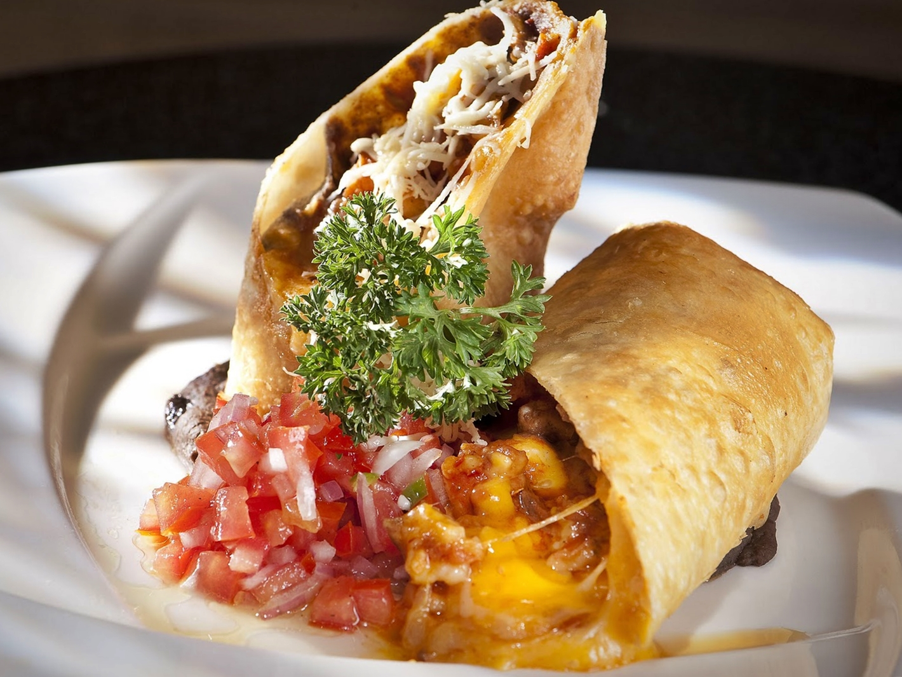

## CHIMICHANGAS DE CAMARÓN ##

**Las tortillas de maíz son muy usadas en México, es hora de que tú aprendas a hacer diferentes platos con ellas además de las clásicas fajitas y qué mejor que empezar con esta fácil receta de chimichangas de camarón.** 

**Antes de comenzar**

Una breve historia del origen de las chimichangas, da clic en la siguiente liga para ver el video.

https://www.youtube.com/watch?v=czkXzhaWQS8

**Ahora si, a cocinar**

**INGREDIENTES**

° 1 cucharada de aceite de oliva

° 1/4 de cebolla finamente picada

° 1 diente de ajo

° 1 taza de camarón tipo pacotilla (de preferencia Chiapas para un mejor sabor)

° 1 cucharada de chile chipotle molido (opcional)

° 1 cucharadita de sal

° 8 tortillas de harina

° 1/2 taza de frijol refrito

° 1/2 taza de queso asadero o amarillo en tiritas

° 1 taza de aceite

° Zumo de limón (opcional)

° Opcional para acompañar: 1/2 taza de crema ácida, 1 taza de guacamole, pico de gallo, cilantro.

### ¿Cómo hacer chimichangas de camarón? ###

***° 1 Sobre un sartén vierte el aceite de oliva y colócalo a fuego medio, cuando se caliente añade la cebolla y el ajo para que se cocinen.***

***° 3 En cada tortilla de maíz coloca una cucharada de frijoles refritos, espárcelo y agrega los camarones por encima junto con queso.***

***° 4 Para cerrar la tortilla en forma de chimichanga doblas la tortilla y unta un poco de yema de huevo en el borde interno de uno de los lados de la tortilla para que se adhiera al seguirla plegando.***

***° 5 En un sartén con aceite caliente fríe las chimichangas de camarón hasta que estén completamente doradas, lo conseguirás en aproximadamente 3 minutos.***

Y al terminar... acompáñalas con una cerveza (o dos)

